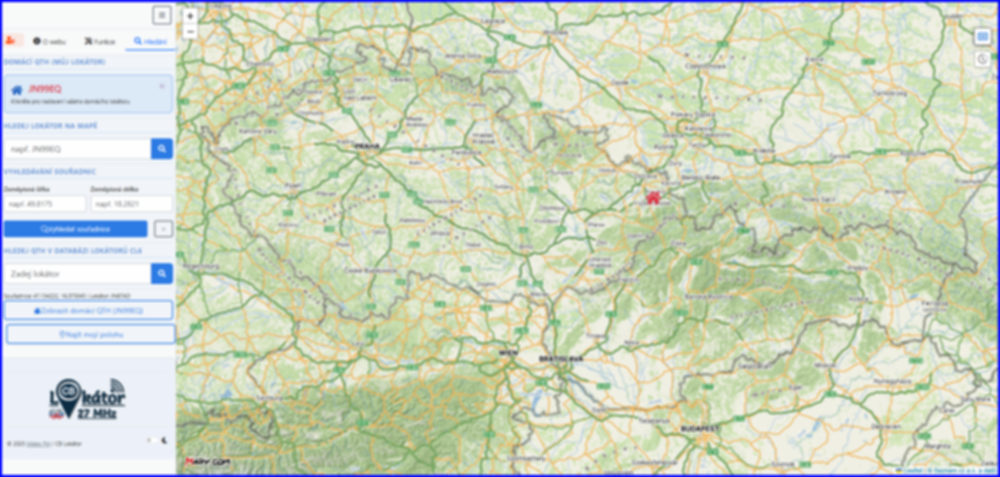
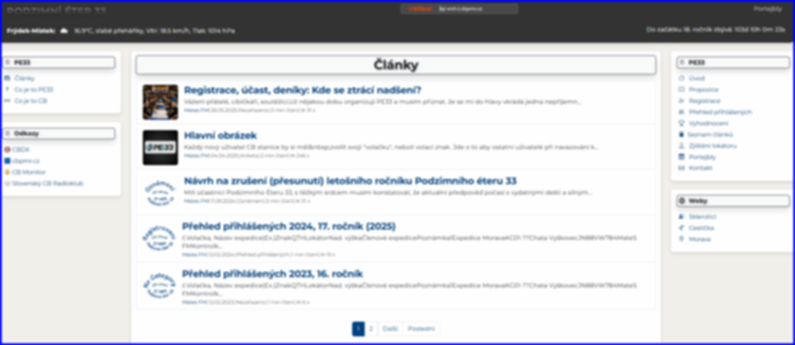
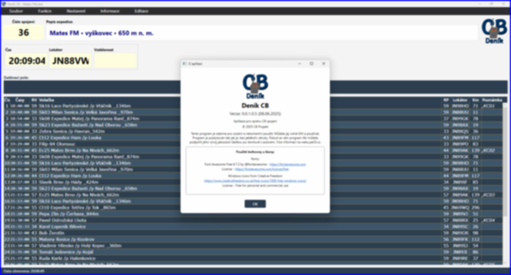

# Ahoj, jsem Mates FM 👋

Učím se webové technologie a vytvářím vlastní aplikace zaměřené na CB vysílání a komunitu okolo něj. 

## 🧭 Projekty, na kterých právě pracuji:

### 📍 CB Lokátor  
Webová aplikace pro zobrazení CB stanic na mapě podle lokátorů a přesných souřadnic.  

---

### 🌐 CB Svět  
Komunitní portál pro CB nadšence – novinky, články, sdílení informací a podpora závodu [PE33](https://pe33.cz).  

---

### 📘 CB Deník  
Elektronický deník pro expedice, který automaticky vyhodnocuje spojení (vzdálenost, body, lokátory) a uchovává jejich historii.  

---

## ⚙️ Technologie

**Web:** HTML · CSS · PHP · MySQL · JavaScript · OpenStreetMap · API Seznamu  
**Aplikace:** C# (Windows Forms, WPF) · Android (Java/Kotlin) · SQLite · REST API

---

📍 Žiju v Novém Jičíně  
📡 CB vysílání je moje srdcovka  
🎯 Můj cíl: propojit moderní technologie s klasickou CB komunikací a její modernizací
